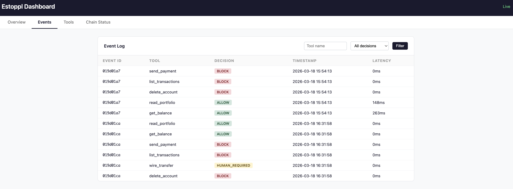

# estoppl

See what your AI agent is doing. Stop it when it goes wrong.

`estoppl` is a transparent proxy for [MCP](https://modelcontextprotocol.io) (Model Context Protocol) that intercepts every tool call your AI agent makes — logging, signing, and enforcing guardrails before anything reaches the upstream server.

One config change. Zero code modifications. Your agent doesn't know it's there.

```
┌──────────────┐          ┌─────────────┐          ┌──────────────┐
│  Agent Host  │ ──────▶  │   estoppl   │ ──────▶  │  MCP Server  │
│  (Claude,    │ ◀──────  │             │ ◀──────  │  (Stripe,    │
│   Cursor)    │          │  intercept  │          │   GitHub)    │
└──────────────┘          │  guardrails │          └──────────────┘
                          │  sign + log │
                          └──────┬──────┘
                                 │
                          ┌──────▼──────┐
                          │  audit log  │
                          │  (signed,   │
                          │   chained)  │
                          └─────────────┘
```

## Why this matters

MCP tool calls are the new attack surface. AI agents autonomously call APIs, execute code, and move money — and most teams have zero visibility into what's happening.

Real attack vectors estoppl helps defend against:

- **[Tool Poisoning](https://invariantlabs.ai/blog/mcp-security-notification-tool-poisoning-attacks)** — malicious instructions hidden in tool metadata cause agents to exfiltrate data or execute unauthorized actions. [MCPTox research](https://arxiv.org/abs/2508.14925) shows attack success rates exceeding 60% across 20 major LLM agents.
- **[Prompt Injection via MCP](https://unit42.paloaltonetworks.com/model-context-protocol-attack-vectors/)** — attackers embed instructions in user-supplied input that trigger automated tool calls. In 2025, this led to [real data exfiltration through Supabase's Cursor agent](https://datasciencedojo.com/blog/mcp-security-risks-and-challenges/).
- **[Command Injection (CVE-2025-6514)](https://www.practical-devsecops.com/mcp-security-vulnerabilities/)** — malicious MCP servers achieving remote code execution on client machines, affecting 437,000+ installs.
- **Runaway agents** — an agent in a loop calling Stripe 200 times, or making a $500k wire transfer because the prompt was ambiguous.

Estoppl sits in front of all of this:
- **Allow/block lists** — only permitted tools reach the server. Everything else is rejected.
- **Amount thresholds** — block any call where the amount exceeds your limit.
- **Rate limiting** — cut off agents that call tools too many times per minute.
- **Signed, hash-chained audit trail** — every tool call is logged with Ed25519 signatures and tamper-evident chaining. If someone modifies the log, `estoppl audit --verify` detects it.
- **Zero data retention** — only SHA-256 hashes of inputs/outputs are stored, never raw data. Safe for PII, financial data, API keys.

## Install

```bash
# Homebrew (macOS / Linux)
brew tap estoppl/tap && brew install estoppl

# npm (recommended for regular use)
npm install -g estoppl

# Or try without installing
npx estoppl

# Cargo (Rust)
cargo install estoppl
```

## 3 commands to get started

```bash
estoppl init --agent-id my-agent
estoppl wrap                    # auto-wraps Claude Desktop, Cursor, Windsurf configs
estoppl tail                    # live-stream tool calls as they happen
```

Restart your MCP client (Cursor, Claude Desktop, etc.) and every tool call now flows through estoppl. The proxy runs as a subprocess — your MCP client starts it automatically via the wrapped config.



## What the audit log looks like

```
$ estoppl audit -n 10

EVENT      TOOL                           DECISION     TIMESTAMP              LATENCY
------------------------------------------------------------------------------------------
019d01a7   read_portfolio                 ALLOW        2026-03-18 15:54:13    0ms
019d01a7   get_balance                    ALLOW        2026-03-18 15:54:13    0ms
019d01a7   send_payment                   BLOCK        2026-03-18 15:54:13    0ms
019d01a7   list_transactions              BLOCK        2026-03-18 15:54:13    0ms
019d01a7   wire_transfer                  HUMAN_REQ    2026-03-18 15:54:13    0ms
019d01a7   delete_account                 BLOCK        2026-03-18 15:54:13    0ms

Total: 6 | Allowed: 2 | Blocked: 3 | Human Review: 1

$ estoppl audit --verify
Hash chain INTACT — 6 events verified
```

## Configuration

`estoppl init` generates `estoppl.toml`:

```toml
[agent]
id = "my-agent"
version = "0.1.0"

[rules]
human_review_tools = ["wire_transfer", "execute_trade"]
max_amount_usd = 50000.0
amount_field = "amount"

# Connect to estoppl cloud (https://app.estoppl.ai)
# [ledger]
# cloud_api_key = "sk_your_key"
# org_id = "your_org_id"
```

Add `cloud_api_key` and `org_id` to enable cloud sync, the remote kill switch, and human review. Cloud sync starts automatically — no extra flags needed.

### How guardrails work

| Rule | What it does | Example |
|------|-------------|---------|
| **Allow list** | Only listed tools are permitted (secure-by-default) | `allow_tools = ["read.*"]` |
| **Block list** | These tools are always rejected (overrides allow list) | `block_tools = ["rm_rf.*"]` |
| **Human review** | Call goes through but flagged in audit log | `human_review_tools = ["wire_transfer"]` |
| **Amount threshold** | Blocks calls exceeding a USD limit | `max_amount_usd = 50000.0` |
| **Rate limiting** | Blocks after N calls per minute | `rate_limit_per_minute = 30` |

## MCP client configuration

### stdio mode (local MCP servers)

Drop the proxy into your MCP client config:

```json
{
  "mcpServers": {
    "stripe": {
      "command": "estoppl",
      "args": ["start", "--upstream-cmd", "npx", "--upstream-args", "@stripe/mcp-server"]
    }
  }
}
```

Or just run `estoppl wrap` to do this automatically for Claude Desktop, Cursor, and Windsurf.

### HTTP mode (remote MCP servers)

```bash
estoppl start-http --upstream-url https://mcp.stripe.com/v1
# Point your MCP client at http://127.0.0.1:4100
```

## All CLI commands

| Command | Description |
|---------|-------------|
| `estoppl init` | Initialize config, keypair, and database |
| `estoppl start` | Start stdio proxy (wraps a local MCP server) |
| `estoppl start-http` | Start HTTP proxy (reverse proxy for remote MCP) |
| `estoppl wrap` | Auto-wrap MCP client configs (Claude, Cursor, Windsurf) |
| `estoppl unwrap` | Restore original MCP client configs |
| `estoppl audit` | View audit log with filters (`--tool`, `--decision`, `--since`) |
| `estoppl audit --verify` | Verify hash chain integrity |
| `estoppl tail` | Live-stream tool calls as they happen |
| `estoppl stats` | Tool call volume, latency, per-tool breakdown |
| `estoppl dashboard` | Local web dashboard at http://127.0.0.1:4200 |
| `estoppl bench` | Measure proxy overhead (p50/p95/p99 latency vs direct) |
| `estoppl report` | Generate HTML activity report |

## How it works under the hood

- **Language**: Rust (tokio async runtime)
- **Signing**: Ed25519 via ed25519-dalek
- **Storage**: Local SQLite with WAL mode, hash-chained events
- **HTTP**: axum for HTTP proxy and dashboard
- **Zero dependencies at runtime**: single static binary

Every event is logged at interception time — before it reaches the upstream server. Events are never lost, even if the proxy exits mid-call. The hash chain links every event to the previous one. Tampering with any event breaks the chain and is detectable via `estoppl audit --verify`.

```
src/
├── main.rs          CLI entry point (clap)
├── config/          Configuration loading and defaults
├── mcp/             MCP JSON-RPC type definitions
├── identity/        Ed25519 key management and signing
├── policy/          Rules-based policy engine
├── ledger/          Local SQLite storage with hash chaining
├── proxy/           stdio + HTTP/SSE proxy core
├── sync/            Cloud sync background task
├── report/          HTML compliance report generator
├── wrap/            Auto-wrap MCP client configs
└── dashboard/       Local web dashboard (axum + embedded HTML)
```

## Cloud sync

Add your cloud credentials to `estoppl.toml` and sync starts automatically:

```toml
[ledger]
cloud_api_key = "sk_your_key"
org_id = "your-org-id"
```

Events always persist locally first. Cloud sync is best-effort with exponential backoff, gap detection, and automatic reconciliation. See [ARCHITECTURE.md](ARCHITECTURE.md) for details on chain integrity under network partitions.

### Remote kill switch

When `cloud_api_key` and `org_id` are configured, the proxy polls the cloud for policy updates every 5 seconds. If an admin blocks a tool in the cloud dashboard, every proxy in the org picks it up and starts rejecting that tool — no restart required.

## estoppl Cloud

The open-source proxy works standalone — no account needed. For teams that need org-wide visibility, connect it to [estoppl cloud](https://app.estoppl.ai) (free during early access):

- **Real-time dashboard** — monitor every agent across your org
- **Remote kill switch** — block a tool from the dashboard, every proxy updates within 5 seconds
- **Human review** — high-risk tool calls pause until a human approves via dashboard, Slack, or webhook
- **Compliance exports** — downloadable evidence packs with chain verification proof
- **Alerting** — Slack and webhook notifications on policy violations

Add two lines to your `estoppl.toml` and sync starts automatically:

```toml
[ledger]
cloud_api_key = "sk_your_key"
org_id = "your-org-id"
```

Sign up at [app.estoppl.ai](https://app.estoppl.ai) or [book a demo](https://calendly.com/tina-estoppl/30min).

## Roadmap

- [x] stdio + HTTP/SSE proxy modes (full MCP Streamable HTTP transport)
- [x] Guardrails: allow lists, block lists, wildcards, amount thresholds, rate limiting
- [x] Ed25519 signed, hash-chained audit log
- [x] `estoppl wrap` — one-command setup for Claude Desktop, Cursor, Windsurf
- [x] Cloud sync with chain verification and gap reconciliation
- [x] Remote kill switch — cloud-managed policy hot-reload
- [x] Attestation header (`X-Estoppl-Attestation`) on forwarded HTTP requests
- [x] Cloud dashboard with real-time monitoring, policy editor, human review
- [x] Blocking human review — tool calls pause until explicit approval
- [ ] Cloud verification API — upstream servers verify attestations before processing
- [ ] Immutable WORM storage for regulated industries (SEC 17a-4)
- [ ] OPA integration for enterprise policy management
- [ ] OpenAI function calling + A2A protocol interception

See [ARCHITECTURE.md](ARCHITECTURE.md) for technical details.

## Security research

MCP security is an active and rapidly evolving area. Key references:

- [MCP Security Best Practices](https://modelcontextprotocol.io/specification/draft/basic/security_best_practices) — official MCP specification
- [Tool Poisoning Attacks](https://invariantlabs.ai/blog/mcp-security-notification-tool-poisoning-attacks) — Invariant Labs
- [MCPTox: Benchmark for Tool Poisoning](https://arxiv.org/abs/2508.14925) — attack success rates >60% across 20 LLM agents
- [Prompt Injection via MCP Sampling](https://unit42.paloaltonetworks.com/model-context-protocol-attack-vectors/) — Palo Alto Unit 42
- [MCP Security Risks and Controls](https://www.redhat.com/en/blog/model-context-protocol-mcp-understanding-security-risks-and-controls) — Red Hat
- [Timeline of MCP Security Breaches](https://authzed.com/blog/timeline-mcp-breaches) — AuthZed
- [MCP Tools: Attack Vectors and Defense](https://www.elastic.co/security-labs/mcp-tools-attack-defense-recommendations) — Elastic Security Labs

## Documentation

Full documentation including CLI reference, configuration, guardrails, and Cloud API: [estoppl.ai/docs](https://estoppl.ai/docs)

## License

Apache 2.0
